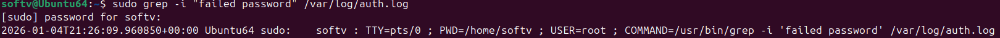

# Prueba del comando auth.log

## sudo ls -lh /var/log/aut.log
- Muestra que el archivo exista y que esté activo.

## sudo tail -n 50 /var/log/auth.log
- Muestra los 50 registros recientes.

## sudo grep -i "failed password" /var/log/auth.log
- Buscar intentos fallidos de login por contraseña incorrecta.

## sudo grep -i "invalid user" /var/log/auth.log
- Busca intentos de login por usuarios inexistentes. En este caso solo se encuentra la búsqueda realizada por mí al contener el "sshd", para evitarlo se realiza el uso de otro comando, "sudo grep -i "sshd" /var/log/auth.log | grep -v "sudo:"

##sudo grep "X.X.X.X" /var/log/auth.log
- Filtra eventos de una IP única.
